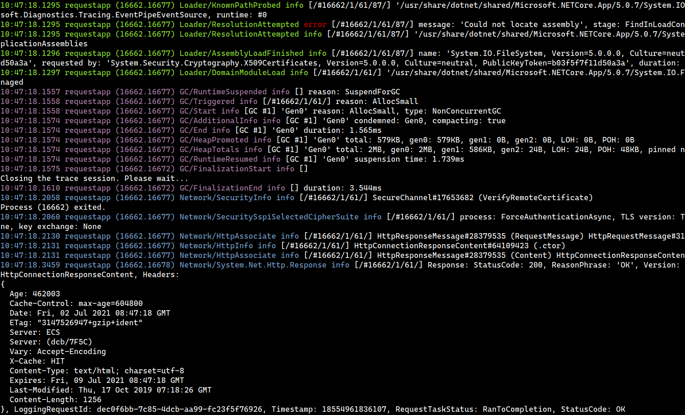

# dotnet-wtrace


**The project homepage is at <https://wtrace.net>.**

Dotnet-wtrace is a command-line tool for reading trace events emitted by .NET Core applications. It can trace a process from its launch, attach to an already running process, or read a .nettrace file. Compared to dotnet-trace, it outputs events as they arrive (there is some delay because of the buffering on the target process side). It is not meant to replace dotnet-trace but rather help you in the initial problem diagnosis. To make the events data more readable, dotnet-wtrace does some preprocessing and might not show all the event fields. I implemented several handlers for the most useful (in my opinion) events. Those events include exceptions, GC, loader, ASP.NET Core, EF Core, and network events. You may limit the output by selecting specific handlers and setting filters. Check the [documentation](https://wtrace.net/documentation/dotnet-wtrace) to learn more.

An example command line:

```
dotnet-wtrace --handlers network,gc,loader /tmp/requestapp https://example.net
```

A screenshot of an example output:



## Installation

The precompiled binaries are available on the [release page](https://github.com/lowleveldesign/dotnet-wtrace/releases).

You may also install dotnet-wtrace as one of the dotnet global tools:

```
dotnet tool install -g dotnet-wtrace
```

## Usage

The available options are listed below. Please check the [dotnet-wtrace documentation page](https://wtrace.net/documentation/dotnet-wtrace) to learn details about them with some usage examples.

```
Usage: dotnet-wtrace [OPTIONS] [pid|imagename args|.nettrace file]

Options:
  -f, --filter=FILTER   Displays only events which satisfy a given FILTER.
                        (Does not impact the summary)
  --handlers=HANDLERS   Displays only events coming from the specified HANDLERS.
  --newconsole          Starts the process in a new console window. (Windows only)
  --nocolor             Do not color the output.
  -l, --level=LEVEL     Log level (1 [critical] - 5 [debug]), default: 4 [info]
  -v, --verbose         Shows wtrace-dotnet diagnostics logs.
  -h, --help            Shows this message and exits.

  The HANDLERS parameter is a list of handler names, separated with a comma.

  Accepted handlers include:
    network   - to receive network events
    loader    - to receive assembly loader events
    gc        - to receive GC events
    aspnet    - to receive ASP.NET Core events
    efcore    - to receive EF Core events

  The default handler is always enabled and displays information about exceptions
  and runtime.

  Example: --handlers 'loader,gc'

  Each FILTER is built from a keyword, an operator, and a value. You may
  define multiple events (filters with the same keywords are OR-ed).

  Keywords include:
    name    - filtering on the event name
    path    - filtering on the event path
    details - filtering on the event details

  Operators include:
    = (equals), <> (does not equal), <= (ends with), >= (starts with), ~ (contains)

  Examples:
    -f 'name >= Sockets/'
    -f 'level <= 4'
    -f 'name = GC/Start' -f 'name = GC/End'
```
